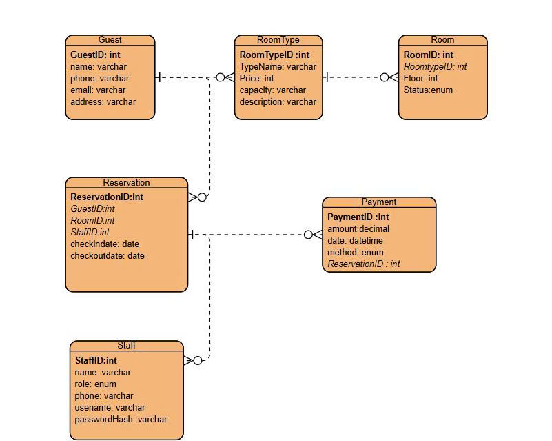

# 🛠️ Software Engineering Project – Hotel Booking System

## 📌 Giới thiệu
Dự án này được phát triển trong môn **Nhập môn Công nghệ Phần mềm**.  
Mục tiêu là áp dụng quy trình phát triển phần mềm, từ **phân tích yêu cầu, thiết kế, lập trình, kiểm thử và triển khai**.

---

## 👥 Thành viên nhóm
- Nguyễn Lê Tường Vi Leader  
- Phạm Thị Tâm Như – Developer  
- Nguyễn Thị Khánh An – Developer  
- Võ Nguyễn Hà Giang – Tester  

---

## 🎯 Use Case chính
- Quản lý người dùng  
- Quản lý đặt phòng  
- Xử lý thanh toán giao dịch  
- Báo cáo & thống kê  

**Sơ đồ Use Case:**  

---

## 📐 Thiết kế hệ thống
- **Use Case Diagram:**   
- **Sequence Diagram:**   
- **ERD (Entity Relationship Diagram):**   
- **Entity Relationship chi tiết:**   

---
##  UseCase Decription
UC-01: Đặt phòng khách sạn

Actor: Khách hàng

Mục tiêu: Đặt phòng theo ngày và loại phòng mong muốn.

Luồng chính:

Khách chọn ngày check-in/out.

Hệ thống hiển thị phòng trống.

Khách chọn phòng, nhập thông tin.

Hệ thống lưu đơn, trả mã đặt phòng.

Ngoại lệ: Không có phòng → báo lỗi; nhập thiếu thông tin → yêu cầu nhập lại.

Kết quả: Đơn đặt phòng được lưu, khách nhận mã đặt phòng.

UC-02: Thanh toán đặt phòng

Actor: Khách hàng, Cổng thanh toán

Mục tiêu: Thanh toán online cho đơn đặt phòng.

Luồng chính:

Khách chọn đơn cần thanh toán.

Hệ thống hiển thị chi tiết & gửi đến cổng thanh toán.

Nếu thành công → cập nhật trạng thái “Đã thanh toán”.

Ngoại lệ: Thanh toán thất bại/gián đoạn → báo lỗi, giữ trạng thái “Chưa thanh toán”.

Kết quả: Giao dịch được ghi nhận, đơn chuyển “Đã thanh toán”.

## 💻 Công nghệ sử dụng
- **Ngôn ngữ:** Java / Python / JavaScript / PHP  
- **IDE:** Visual Studio Code  
- **CSDL:** MySQL  
- **Quản lý phiên bản:** Git + GitHub  
- **Mô hình phát triển:** Agile – Scrum  

---

## ✅ Kết quả
- Đã xây dựng sơ đồ Use Case, Sequence, ERD.  
- Có báo cáo tiến độ và quản lý công việc bằng Jira.  
