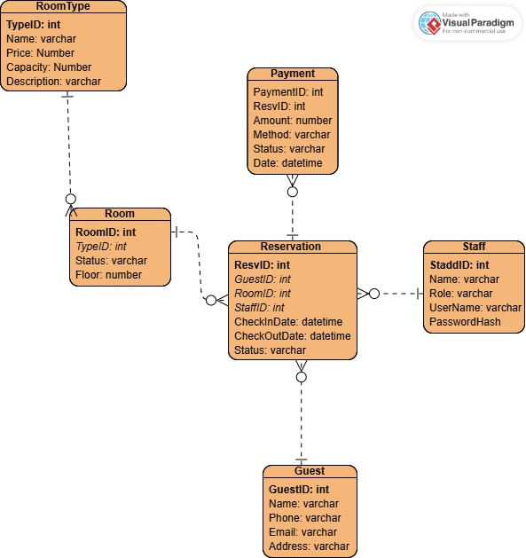

# 🛠️ Software Engineering Project – Hotel Booking System

## 📌 Giới thiệu
Dự án này được phát triển trong môn **Nhập môn Công nghệ Phần mềm**.  
Mục tiêu là áp dụng quy trình phát triển phần mềm, từ **phân tích yêu cầu, thiết kế, lập trình, kiểm thử và triển khai**.

---

## 👥 Thành viên nhóm
- Nguyễn Lê Tường Vi Leader  
- Phạm Thị Tâm Như – Developer  
- Nguyễn Thị Khánh An – Developer  
- Võ Nguyễn Hà Giang – Tester  

---

## 🎯 Use Case chính
- Quản lý người dùng  
- Quản lý đặt phòng  
- Xử lý thanh toán giao dịch  
- Báo cáo & thống kê  

**Sơ đồ Use Case:**  

---

## 📐 Thiết kế hệ thống
- **Use Case Diagram:**   
- **Sequence Diagram:**   
- **ERD (Entity Relationship Diagram):**   
- **Entity Relationship chi tiết:**   

---

## 💻 Công nghệ sử dụng
- **Ngôn ngữ:** Java / Python / JavaScript / PHP  
- **IDE:** Visual Studio Code  
- **CSDL:** MySQL  
- **Quản lý phiên bản:** Git + GitHub  
- **Mô hình phát triển:** Agile – Scrum  

---

## ✅ Kết quả
- Đã xây dựng sơ đồ Use Case, Sequence, ERD.  
- Có báo cáo tiến độ và quản lý công việc bằng Jira.  
