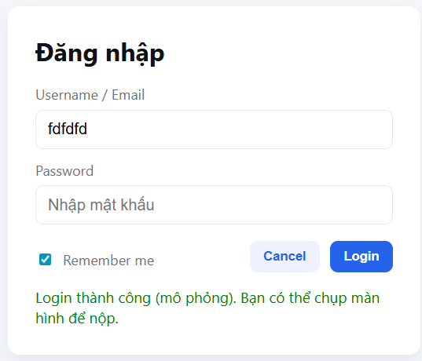
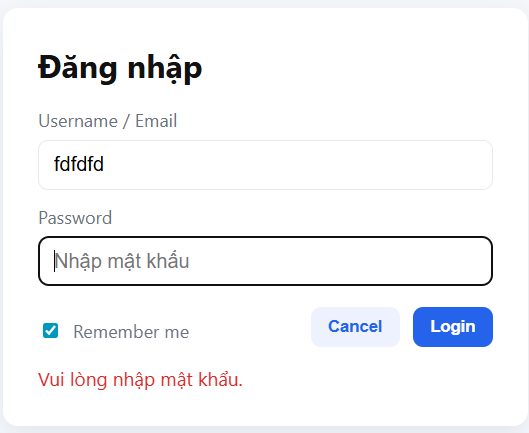

---

## 🚀 Cách chạy
- Mở trực tiếp `index.html` trên trình duyệt **hoặc**  
- Dùng VS Code + extension **Live Server** để chạy:  
  - Chuột phải vào `index.html` → chọn **Open with Live Server**  

---

## 🖼️ Demo

### ✅ Trường hợp nhập đúng

### ⚠️ Trường hợp nhập thiếu dữ liệu

### 💾 Chức năng Remember Me

---

## 💻 Công nghệ sử dụng
- **HTML5** + **CSS3**  
- **JavaScript**  
- **VS Code** + Live Server  
- **Git + GitHub** để quản lý source code
