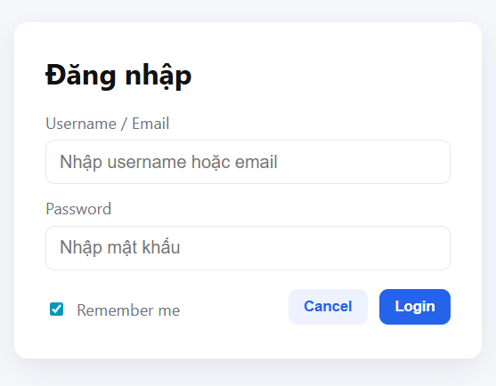

# 📝 Project Report – ATM & Hotel Booking Mini Project

## 1. Giới thiệu
Báo cáo tổng hợp từ Lab 02–04 trong môn Nhập môn Công nghệ Phần mềm.  
Mục tiêu: áp dụng quy trình phát triển phần mềm (phân tích, thiết kế, lập trình, kiểm thử).

## 2. Artifacts
### Lab 02 – Use Case (Hotel Booking System)
- 

### Lab 03 – Sequence Diagram (ATM Withdraw)
- 

### Lab 04 – Form Login
- Source code: `index.html`, `style.css`, `script.js`
- Screenshot:
  

## 3. Quy trình làm việc
- Sử dụng Git/GitHub để quản lý phiên bản.  
- Mỗi lab lưu trong thư mục riêng.  
- Commit và push thường xuyên để theo dõi tiến độ.  

## 4. Kết luận
- Hoàn thành từ yêu cầu phân tích → thiết kế → lập trình.  
- Sẵn sàng cho các bước tích hợp, kiểm thử và triển khai.
